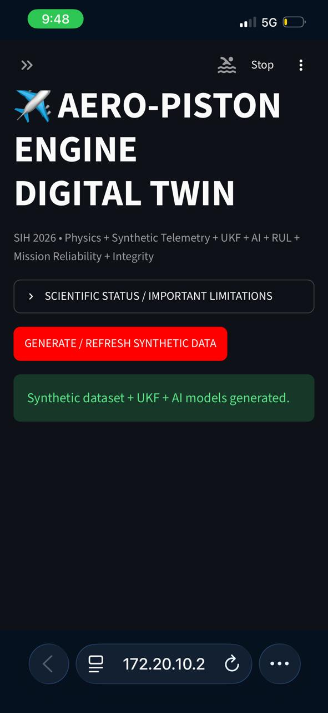
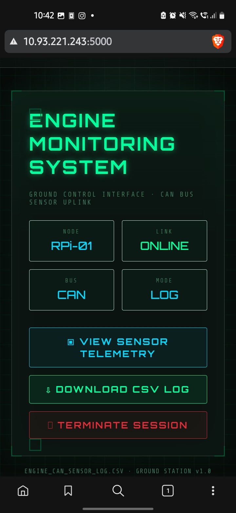
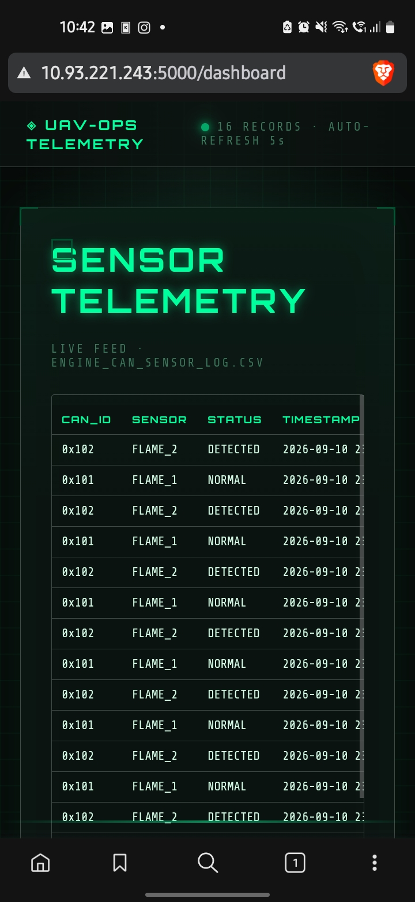

# UAV-Twin-Engine-Monitor
This is a project that explains the method to extract data from sensors and implement as an AI based  twin engine monitoring software.
The prototype consists of 3 parts:
## 1.Arduino Script
This sketch is integrated with NODEMCU .Download the given sketch nd with the NODEMCU dependency and edit the sensors to your preferences. Here I have used flame sensors as an example which detect heat and transmits the message through serial monitor.
This with a microprocesser like Rasberry Pi .
## 🛰️ UAV Engine Telemetry Ground Station (loggerv2.py)

A lightweight **Flask web dashboard** for viewing and downloading UAV/aero-engine CAN-bus sensor logs from a Raspberry Pi ground node — a login-gated "mission control" style HUD for the CSV telemetry log produced elsewhere in the pipeline (e.g. by the CAN bus logger feeding `engine_can_sensor_log.csv`).

### What it does

- **Login-gate access** — a session-based login screen guards every page and API route.
- **Home / status page** — shows node name, link status, bus type and logging mode at a glance.
- **Live sensor telemetry view** (`/dashboard`) — auto-refreshing (every 5s) HTML table of the most recent 200 log rows, pulled from a small JSON API.
- **JSON telemetry API** (`/data`) — returns the full CSV log as JSON records, for the dashboard's auto-refresh or for other tools to consume.
- **CSV download** (`/download`) — serves the raw `engine_can_sensor_log.csv` file as a download.
- **Logout** — clears the session.
- **Custom "UAV-ops HUD" theme** — a self-contained, hacker-HUD-styled UI (scanlines, glow, monospace, animated status dot) shared across all pages, no external CSS framework required.

### Tech stack

`Python` · `Flask` · plain HTML/CSS/JS (no frontend framework) — reads telemetry from a CSV file via Python's built-in `csv` module.

### Routes

| Route | Method | Description |
|---|---|---|
| `/login` | GET/POST | Login form and auth check |
| `/` | GET | Home/status dashboard (requires login) |
| `/dashboard` | GET | Live auto-refreshing telemetry table (requires login) |
| `/data` | GET | JSON API returning all CSV rows (requires login) |
| `/download` | GET | Download the CSV log file (requires login) |
| `/logout` | GET | Clear session and return to login |

### Running it

```bash
pip install flask
python loggerv2.py
```
The server starts on `http://0.0.0.0:5000`, so it's reachable from other devices on the same network (e.g. a ground-station laptop talking to a Raspberry Pi).

### Configuration you must change before using this

This script ships with placeholder/local values that need to be set per deployment:

- `app.secret_key` — currently a placeholder string; **must** be replaced with a real random secret before any real use (Flask sessions are insecure without this).
- `USERNAME` / `PASSWORD` — currently hardcoded (`admin` / `engine123`); replace with real credentials, and ideally move them to environment variables instead of source code.
- `CSV_FILE` — currently an absolute local path (`/home/manvith/Downloads/engine_can_sensor_log.csv`); update this to wherever the CAN logger actually writes its CSV on your deployment machine.

### Limitations / not production-hardened

- Plaintext hardcoded credentials and secret key in source — fine for a local prototype/demo, not for anything exposed beyond a trusted local network.
- No HTTPS/TLS — traffic (including the login form) is unencrypted.
- No rate limiting on the login route.
- Single shared login (no per-user accounts, roles, or audit log).

## ✈️ Aero-Piston Engine Digital Twin

A single-file **Streamlit prototype** of a hybrid, mission-aware digital twin for a generic aero-piston (small aircraft/UAV) engine — combining a physics-based simulation, a custom Unscented Kalman Filter, and machine-learning models for fault diagnosis, remaining-useful-life (RUL) estimation, and mission reliability.

> ⚠️ **Status: research/prototype only.** All telemetry is synthetically generated, all health/RUL/reliability figures are model estimates, and nothing in this project is flight-certified or validated against a real engine. See [Limitations](#limitations) below.

### What it does

- **Physics model** — a transparent, first-principles-plus-empirical model of a piston aero-engine (RPM, MAP, cylinder head temp, oil temp/pressure, torque, fuel flow, vibration) responding to throttle, load, altitude and ambient conditions.
- **Synthetic telemetry generator** — produces multi-engine, run-to-failure time series with realistic sensor noise, bias, drift and outliers.
- **Custom Unscented Kalman Filter (UKF)** — fuses noisy sensor readings back into a clean state + health estimate.
- **AI/ML layer** — Random Forest fault classification, Random Forest RUL regression, and an Isolation Forest for anomaly detection, all trained on the synthetic dataset with a chronological train/test split.
- **Health Index & diagnostics** — a composite health score plus a rule/ML-based diagnosis of the most likely fault mode with a confidence score.
- **Mission simulation & Monte Carlo reliability** — simulates a full mission profile and runs hundreds of stochastic trials to estimate mission success probability and confidence intervals.
- **What-if analysis & throttle optimization** — compare two mission scenarios, or grid-search throttle settings for best predicted reliability.
- **CSV upload** — bring your own telemetry with automatic column mapping.
- **3D engine schematic** — a lightweight Plotly visualization driven by live estimated RPM.
- **Telemetry integrity** — SHA-256 hash chaining + HMAC-SHA256 signing for tamper-evident telemetry logs.
- **Validation tab** — UKF RMSE, model accuracy/precision/recall/F1, RUL error metrics, and built-in self-tests.
- **Export** — download results as CSV, JSON report, or plain-text report.

### Why NASA C-MAPSS is mentioned

The prognostics/RUL *methodology* is inspired by NASA's C-MAPSS turbofan degradation dataset, which is the standard benchmark in that field. **C-MAPSS itself is turbofan data, not piston-engine data** — it isn't used as ground truth here. It's referenced only for the run-to-failure/prognostics approach; all actual telemetry in this project is generated from the custom aero-piston physics model.

### Tech stack

`Python` · `Streamlit` (UI) · `NumPy` / `SciPy` (physics, UKF) · `pandas` (data handling) · `scikit-learn` (Random Forest classifier/regressor, Isolation Forest) · `Plotly` (charts, 3D visualization)

### Running it

```bash
pip install streamlit numpy pandas scipy scikit-learn plotly
streamlit run aero_piston_digital_twin.py
```
### Screenshots



## Contributors
- [Manvith U](https://github.com/manwithu) 
- [Aneesh Sagar Naidu](https://github.com/Aneesh450) 
